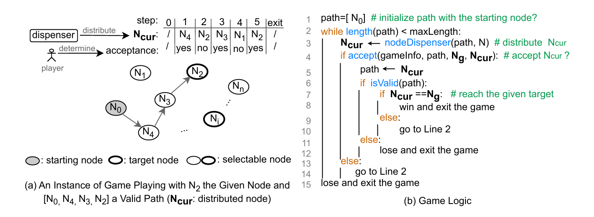

## Segen
Segen is a project to learn a sequence generation policy for the symbolic execution of Solidity smart contracts via training an agent to play the path-finding game constructed from smart contracts.

The game has a set of nodes, each of which corresponds to a function in a smart contract. The player needs to find a valid path for a given target node in order to win.
 
 
 


### Requirements
    opencv-python==4.9.0.80
    Shimmy==1.3.0
    sb3-contrib==2.2.1
    gymnasium==0.29.1
    tensorboard==2.15.1
    tensorboard-data-server==0.7.2

### Training via Pycharm IDE
1, Clone the project:
```
git clonevhttps://github.com/zqp542375/drl_segen.git
```

2, Open the project with Pycharm and install the required packages

3, Training (this step can be escaped as the trained models are available)

Before training on HoloToken.sol and the small dataset, make sure "max_svar_value=80, max_func_value_element=30" in config.py.

```code
 run train_on_HoloToken.py to train on one contract
 run train_on_small_dataset.py to train on 20 contracts
```

Before training on sGudard dataset, make sure "max_svar_value=5740, max_func_value_element=70" in config.py.


```code
 run train_on_HoloToken.py to train on one contract
 run train_on_sGuard.py to train on about 500 contracts
```

4, Generate sequences

Before generating sequences on HoloToken.sol and the testing contracts from the small dataset, make sure "max_svar_value=80, max_func_value_element=30" in config.py.

```code
 run gen_on_HoloToken.py to generate sequences for one contract
 run gen_on_small_dataset.py to genenrate sequences for 8 testing contracts from the samll dataset
```

Note that the contract data ([collected](https://github.com/zqp542375/drl_contract_data_preparation.git) from the small dataset and sGuard dataset) required to construct the game are already collected and saved in json files in "./segen/contract_env_data/". 

An example of running 5 episodes on a game instance constructed from contract HoloToken_test_01.sol with the target node burn():
```consol
target : 4 : HoloToken_test_01.burn(uint256)
score:5.6
	action seq:[1, 0, 0, 1, 1, 1]
	  func seq:[1, 2, 3, 4]
score:5.6
	action seq:[0, 0, 0, 1, 1, 0, 1, 1]
	  func seq:[1, 2, 3, 4]
score:5.6
	action seq:[0, 0, 1, 0, 0, 0, 0, 0, 0, 0, 1, 0, 1, 1]
	  func seq:[1, 2, 3, 4]
score:5.6
	action seq:[0, 0, 0, 0, 0, 0, 1, 1, 0, 1, 1]
	  func seq:[1, 2, 3, 4]
score:0.30000000000000004
	action seq:[1, 1, 1]
	  func seq:[1, 2, 4]

```
